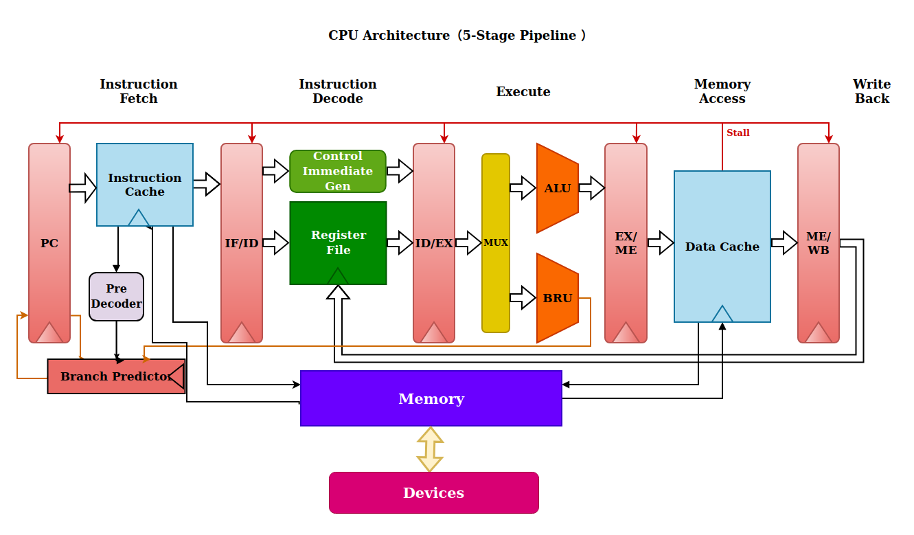
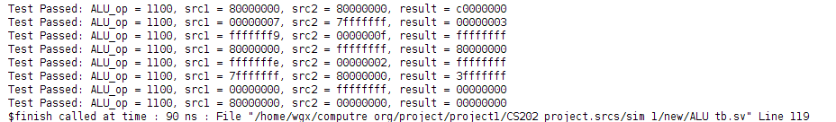

# CS202小组中期答辩自述文档

## 小组信息

**Lab:** 周三7-8节 王薇老师

|   学号   |  姓名  |             分工             |
| :------: | :----: | :--------------------------: |
| 12313023 | 黄思诚 |      核心开发、仿真测试      |
| 12313519 | 李思陈 |      IO 实现、上板调试       |
| 12312030 | 魏国新 | 架构设计、核心开发、汇编软件 |

## 代码规范约定

### 结构化设计

- **单一职责原则**：每个模块仅实现单一功能
- **代码量控制**：每个模块代码量控制在300行以下

```
25SPRING_CS202_PROJECT/
├── docs/
│   ├── system_design.pdf      
│   └── images/                 
├── src/                       
│   ├── CoreCpu/  	#cpu设计文件
│   ├── Sim/     	#仿真测试文件
│   ├── Io/       	#Io处理设计
│   ├── Constrain/ 	#约束处理文件
│   ├── Assembly/  	#汇编                 
├── test/                      # 测试套件
├── tools/                     # 开发工具
├── LICENSE                   # 开源协议
└── README.md                 # 项目说明
```


### 命名规范

| 变量         | 大驼峰（类型缩写可选）     | `StrUserName`       |
| ------------ | -------------------------- | ------------------- |
| **常量**     | **全大写+下划线分隔**      | `DATA_WIDTH`        |
| **设计文件** | **大驼峰（类型缩写可选）** | `RegisterFile`      |
| **仿真文件** | **大驼峰+ 下划线+tb**      | `ALU_tb`            |
| **函数**     | **小写+下划线**            | `handle_r_type_ops` |

#### 特殊项

- 时钟信号直接使用clk进行表示
- 重置信号使用 reset表示
- 运算器直接使用ALU表示
- 内存映射输入输出模块用MMIO表示

#### 禁止项

- 使用拼音缩写（如`yhxx`代替`userInfo`）
- 单字母命名（循环变量`i/j/k`除外）
- 保留字冲突（如`logic` , `int`等）

### 注释要求

#### 接口注释

对于每个模块，使用单行注释表明每个input 和 output信号的含义。

tip: 特别明显的信号除外（Ex. clk,reset）

#### 模块注释

对于一整个实现单一功能的代码块，使用单行或多行注释解释代码的具体功能。

```verilog
/**
     * @brief This always block toggles the temporary clock signal when the counter reaches 50.
     */
    always @(posedge clk) begin
        if (Cnt == 16'd50) begin
            t <= ~t;  // Toggle the temporary clock signal
        end 
    end
```

### 常量

- 集中存放于`constants`目录下的独立头文件`Constants.vh`中
- 采用全大写+下划线分隔方式进行命名
- 用 ``include "Constants.vh"` 语句进行导入并使用

## CPU 特性说明

### 单周期CPU

- ***冯诺依曼架构***支持 ***RISC-V*** 指令集的***五级流水线*** CPU

  + 采用前递、分支预测的方式解决冒险

  + 含 32 个 32 bit 的寄存器   
  +  寻址单位为 32 bit (4 byte)

- **时钟频率:** 
  + CPU: 最高可支持 10MHz

### Pipeline

- ***冯诺依曼架构***支持 ***RISC-V*** 指令集的***五级流水线*** CPU

  + 采用前递、分支预测的方式解决冒险

  + 含 32 个 32 bit 的寄存器   
  +  寻址单位为 32 bit (4 byte)

- **时钟频率:** 
  + CPU: 最高可支持 50MHz

### 指令集

RISC-V基础整数指令集（RV32I）定义了47条核心指令，覆盖算术运算（如ADD/SUB）、逻辑操作（AND/OR/XOR）、条件分支（BEQ/BNE）、内存访问（LW/SW）和系统调用（ECALL）等基础功能，其模块化架构允许通过可选扩展实现功能增强；

乘除扩展集（RV32M）在RV32I基础上新增8条指令，包括带符号/无符号的乘法（MUL/MULH/MULHSU/MULHU）、除法（DIV）及取余运算（REM）

| 指令                    | 指令类型 | 执行操作                                  |
| ----------------------- | -------- | ----------------------------------------- |
| `add rd, rs1, rs2`      | R        | rd = rs1 + rs2                            |
| `sub rd, rs1, rs2`      | R        | rd = rs1 - rs2                            |
| `xor rd, rs1, rs2`      | R        | rd = rs1 ^ rs2                            |
| `or rd, rs1, rs2`       | R        | rd = rs1 \| rs2                           |
| `and rd, rs1, rs2`      | R        | rd = rs1 & rs2                            |
| `sll rd, rs1, rs2`      | R        | rd = rs1 << rs2                           |
| `srl rd, rs1, rs2`      | R        | rd = rs1 >> rs2                           |
| `sra rd, rs1, rs2`      | R        | rd = rs1 >> rs2 (sign-extend)             |
| `slt rd, rs1, rs2`      | R        | rd = ( rs1 < rs2 ) ? 1 : 0                |
| `sltu rd, rs1, rs2`     | R        | rd = ( (u)rs1 < (u)rs2 ) ? 1 : 0          |
| `addi rd, rs1, rs2`     | I        | rd = rs1 + imm                            |
| `xori rd, rs1, rs2`     | I        | rd = rs1 ^ imm                            |
| `ori rd, rs1, rs2`      | I        | rd = rs1 \| imm                           |
| `andi rd, rs1, rs2`     | I        | rd = rs1 & imm                            |
| `slli rd, rs1, rs2`     | I        | rd = rs1 << imm[4:0]                      |
| `srli rd, rs1, rs2`     | I        | rd = rs1 >> imm[4:0]                      |
| `srai rd, rs1, rs2`     | I        | rd = rs1 >> imm[4:0] (sign-extend)        |
| `slti rd, rs1, rs2`     | I        | rd = (rs1 < imm) ? 1 : 0                  |
| `sltiu rd, rs1, rs2`    | I        | rd = ( (u)rs1 < (u)imm ) ? 1 : 0          |
| `lb rd, imm(rs1)`       | I        | 读取 1 byte 并做符号位扩展                |
| `lh rd, imm(rs1)`       | I        | 读取 1 half-word (2 bytes) 并做符号位扩展 |
| `lw rd, imm(rs1)`       | I        | 读取 1 word (4 bytes)                     |
| `lbu rd, imm(rs1)`      | I        | 读取 1 byte 并做 0 扩展                   |
| `lhu rd, imm(rs1)`      | I        | 读取 2 byte 并做 0 扩展                   |
| `sb rd, imm(rs1)`       | S        | 存入 1 byte                               |
| `sh rd, imm(rs1)`       | S        | 存入 1 half-word (2 bytes)                |
| `sw rd, imm(rs1)`       | S        | 存入 1 word (4 bytes)                     |
| `beq rs1, rs2, label`   | B        | if (rs1 == rs2)  pc += (imm << 1)         |
| `bne rs1, rs2, label`   | B        | if (rs1 != rs2)  pc += (imm << 1)         |
| `blt rs1, rs2, label`   | B        | if (rs1 < rs2)  pc += (imm << 1)          |
| `bge rs1, rs2, label`   | B        | if (rs1 >= rs2)  pc += (imm << 1)         |
| `bltu rs1, rs2, label`  | B        | if ( (u)rs1 < (u)rs2 )  pc += (imm << 1)  |
| `bgeu rs1, rs2, label`  | B        | if ( (u)rs1 >= (u)rs2 )  pc += (imm << 1) |
| `jal rd, label`         | J        | rd = pc + 4; pc += (imm << 1)             |
| `jalr rd, rs1, imm`     | I        | rd = pc + 4; pc = rs1 + imm               |
| `lui rd, imm`           | U        | rd = imm << 12                            |
| `auipc rd, imm`         | U        | rd = pc + (imm << 12)                     |
| `ecall`                 | I        | 控制权交给固件 (采用输入设备模拟)         |
| `sret` *                | I        | 控制权交还给程序                          |
| `mul rd, rs1, rs2` *    | R        | rd = (rs1 * rs2)[31:0]                    |
| `mulh rd, rs1, rs2` *   | R        | rd = (rs1 * rs2)[63:32]                   |
| `mulhsu rd, rs1, rs2` * | R        | rd = (rs1 * (u)rs2)[63:32]                |
| `mulhu rd, rs1, rs2` *  | R        | rd = ( (u)rs1 * (u)rs2 )[63:32]           |
| `div rd, rs1, rs2` *    | R        | rd = rs1 / rs2                            |
| `rem rd, rs1, rs2` *    | R        | rd = rs1 % rs2                            |

## CPU架构设计

### 接口

```verilog
module Top (
    // clk -> cpuclk, memclk, vgaclk
    input                     clk, reset,
    // uart related
    input  logic              Rx,
    // interact with devices
    input  logic [`SWCH_WID ] Switch1, Switch2, 
    input  logic              Button1, Button2, Button3, Button4, Button5,
    output logic [`LED_WID  ] Led1Out, Led2Out,
    output logic [`LED_WID  ] SegEn, Seg1Out, Seg2Out,
    // vga interface
	output logic              HorSynSignal,         // Horizontal Synchronization Signal
	output logic              VerSynSignal,         // Vertical Synchronization Signal
    output logic [`COLOR_WID] Red,
    output logic [`COLOR_WID] Green,
    output logic [`COLOR_WID] Blue
);
```

#### 输入信号

- 一个 100MHz 的晶振时钟
- 高电平复位信号 rst
- UART 通信串口 rx
- 2 组拨码开关
- 5 个按钮

#### 输出信号

- 2 组 led 
- 7 段数码管的控制信号
- VGA 的控制信号

### 单周期CPU

    Single - Cycle CPU Architecture
    
    Instruction Memory
    ||
    || Fetch
    \/
    Instruction Decode and Register File Read
    ||
    || Decode and Read
    \/
    ALU / Branch Handling
    ||
    || Execute and Branch
    \/
    Memory Access
    ||
    || Memory
    \/
    Write Back to Register File

### 5-stage Pipeline



## C P U 指 令 与 控 制 信 号

### 5. CPU指令与控制信号的关系

| 指令类型                      | Branch | ALUOp    | ALUSrc | MemRead | MemWrite | MemtoReg | RegWrite |
| ----------------------------- | ------ | -------- | ------ | ------- | -------- | -------- | -------- |
| **R型指令**<br>(add, sub等)   | 0      | 类型决定 | 0      | 0       | 0        | 0        | 1        |
| **I型指令**<br>(addi, subi等) | 0      | 具体运算 | 1      | 0       | 0        | 0        | 1        |
| **Load指令**<br>(lw)          | 0      | 0        | 1      | 1       | 0        | 1        | 1        |
| **Store指令**<br>(sw)         | 0      | 0        | 1      | 0       | 1        | 0        | 0        |
| **B型指令**<br>(beq等)        | 1      | 具体运算 | 0      | 0       | 0        | 0        | 0        |
| **J型指令**<br>(jal)          | 1      | -        | 1      | 0       | 0        | 0        | 1        |
| **JALR指令**                  | 1      | 0        | 0      | 0       | 0        | 0        | 1        |
| **LUI指令**                   | 0      | 0        | 1      | 0       | 0        | 0        | 1        |
| **AUIPC指令**                 | 0      | 1        | 1      | 0       | 0        | 0        | 1        |

## 项 目 代 码 以 及 已 搭 建 的 测 试 场 景

### ALU

#### 项目代码

```verilog
module ALU(
    input logic [`DATA_WIDTH] InputA,           // First operand
    input logic [`DATA_WIDTH] InputB,           // Second operand
    input logic [`ALUOP_WIDTH] AluOperation,        // ALU operation control
    output logic [`DATA_WIDTH] Result     // Result of operation
);

    // 定义 64 位乘法结果变量
    logic [63:0] Mul;

    always_comb begin
        // 初始化乘法结果和运算结果
        Mul = 64'h0000_0000_0000_0000;
        Result = {`DATA_LENGTH{1'b0}};

        unique case (AluOperation)
            `ALU_ADD:  Result = InputA + InputB;
            `ALU_SUB:  Result = InputA - InputB;
            `ALU_AND:  Result = InputA & InputB;
            `ALU_OR:   Result = InputA | InputB;
            `ALU_XOR:  Result = InputA ^ InputB;
            `ALU_SLL:  Result = InputA <<  InputB[4:0];   // Shift left logical
            `ALU_SRL:  Result = InputA >>  InputB[4:0];   // Shift right logical
            `ALU_SRA:  Result = $signed(InputA) >>>  InputB[4:0]; // Shift right arithmetic
            `ALU_SLT:  Result = ($signed(InputA) < $signed(InputB)) ? 1 : {`DATA_LENGTH{1'b0}}; // Set less than (signed)
            `ALU_SLTU: Result = (InputA < InputB) ? 1 : {`DATA_LENGTH{1'b0}}; // Set less than unsigned
            // `ALU_LUI:  Result = InputB;      // Load upper immediate
            // `ALU_NOR:  Result = ~(a | b);
            `ALU_MUL: begin
                Mul = $signed(InputA) * $signed(InputB);
                Result = Mul[31:0];
            end
            `ALU_MULH: begin
                Mul = $signed(InputA) * $signed(InputB);
                Result = Mul[63:32];
            end
            `ALU_MULHSU: begin
                logic signed [63:0] SignedInputAExt = {{32{InputA[31]}}, InputA};       
                logic unsigned [63:0] UnsignedInputBExt = $signed({32'b0, InputB});   
                logic signed [127:0] FullMul = SignedInputAExt * UnsignedInputBExt;
                // Mul = $signed(InputA) * $unsigned(InputB);
                // Result = $signed(Mul[63:32]); 
                Result = $signed(FullMul[63:32]); 
            end
            `ALU_MULHU: begin
                Mul = $unsigned(InputA) * $unsigned(InputB);
                Result = Mul[63:32];
            end
            `ALU_DIV:  Result = $signed(InputA) / $signed(InputB);
            `ALU_REM:  Result = $signed(InputA) % $signed(InputB);
            default:   Result = {`DATA_LENGTH{1'b0}};
        endcase
    end

endmodule
```

#### 测试场景



## 开发工具

rara+asm file->txt file+rars2coe->coe file+vivado->write in CPU

- **汇编**：
  - **工具**：[riscv-gnu-toolchain](https://github.com/riscv-collab/riscv-gnu-toolchain)
  - **简介**：这是一个用于RISC-V架构的GNU编译器工具链。
- **仿真**：
  - **工具**：Vivado
  - **简介**：Vivado是Xilinx公司推出的一款功能强大的EDA工具软件，用于FPGA和ASIC的设计与仿真。
- **串口**：
  - **工具**：[UARTAssist](https://github.com/LunaQu4kez/SUSTech_CS202_MineCPU/blob/main/tools/UartAssist.exe) 和 [inst2txt](https://github.com/LunaQu4kez/SUSTech_CS202_MineCPU/blob/main/tools/inst2txt.py)
  - **UARTAssist**：这是一个用于收发UART信号的工具，UART（通用异步收发传输器）是一种常用的串行通信协议，广泛应用于嵌入式系统中用于设备之间的数据传输。
  - **inst2txt**：这个工具用于将指令机器码文件转换为UARTAssist能够传输的16进制文本格式。

## 项目进度

大约40%

- 已完成了CPU的基本架构设计和核心部件的编码实现。
- 完成了部分指令的测试和验证工作。
- 已搭建起初步的硬件测试平台，能够通过串口工具与FPGA硬件进行通信，将指令发送到硬件上执行并观察结果。

## 当前困难

- **复杂指令的实现与优化**：对于一些较为复杂指令（如乘法、除法指令）的实现，目前还存在一定的性能瓶颈，执行效率有待提高。
- **硬件资源限制**：在FPGA硬件平台上，由于资源有限，可能会对CPU设计的规模和复杂度产生限制。
- **测试的全面性和准确性**：随着项目规模的扩大，如何确保测试用例的全面性和测试结果的准确性变得越来越困难。可能存在一些隐性的错误或边界情况未被覆盖到。

## 预计答辩时间

第16周实验课